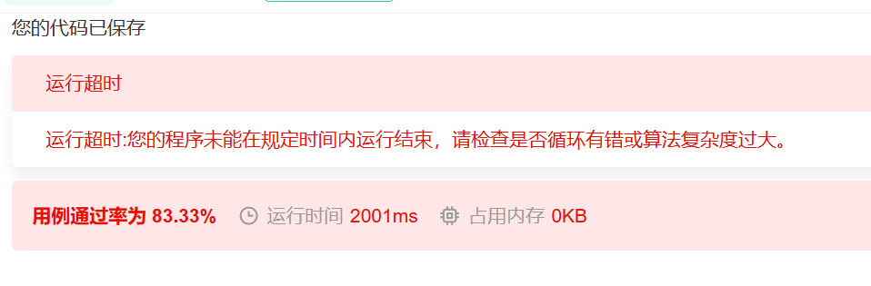

# 牛客练习赛133

久违地来打一打牛客,这次是要算rating的,希望不要一回来就掉分...能不能赶快让我上个2000分啊,md我不想当绿名了...后天的牛客周赛也得正常打,我必须AK牛客周赛!!!

# A
小模拟,写了一堆map草过去了.

# B
有点意思,刚开始想错方向了,想着两棵子树怎么组合怎么求和叽里呱啦一大堆的,后来发现其实每新加一个点,下一次可以加点的位置就多一个,所以总的组合数是n!.然后怎么取余数呢?实际上,如果n比p大,那么必然是0,若n比p小,p是小于1e6的,直接暴力算就可以了.

# C
如图所示:

我想到那个O(nmk)的逆向推导做法了,但是实现出大问题,写了一堆deque,然后就被卡常了.真是太惨了,如果能进一步推导那个数学公式,发现更本质的规律,就可以写出常数小的做法,真是可惜啊,就差一把火,下次加油!

倒在C了,不过这次排在68,应该可以上分.上2000指日可待!!!