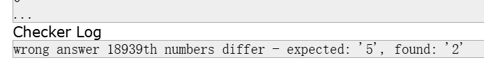

# CF994-Div2

## F
还剩最后一个F没写,这是一道2700分的题目.看了一下,题意很简洁,但是完全没有思路,我根本想不到mex和或运算是怎么联系在一起的.就算按位考虑也没法把mex结合进去啊,直接看题解吧.

看了第一段就给我惊得亚麻呆住了.实际上那一串东西或出来的结果肯定是大于它的最大值的,那么设最大值为m,mex的值就要至少为m+1,所以说0\~m的数字都要有,这就要至少m+1个数字了,也就是说我选的数字至少得是连续不存在空缺的.

就算知道要怎么写,这个更新过程也很难维护啊.我尽力吧.

写了半天,最后还是因为太复杂,又要重构,此时突然注意到题解中的并查集,对啊,为什么不用并查集维护启发式合并呢?这样更方便啊.

拼尽全力无法战胜,写了一下午结果TLE.我重构了好几次代码,疯狂debug才过了6个测试点,真tm快崩溃了.我是用multiset维护数字个数,然后用DSU维护块之间的合并的,理论复杂度正确,但是实际上常数较大,所以过不了这题,太难受了.

虽然没做出来,但这个题目给了我很大启发,简言之就是顶层设计的思想,在写代码之前分析好需求,然后再规划好具体做法,不能写一步想一步,然后就是封装要做好,尽量做到一个函数做好一件事,这样就不容易错.

还是看看其他dalao是怎么写的吧.2700还是太难写了.我突然发现这可能是程序bug导致的Tle,过了6个只是假象罢了.woc了继续debug!!!

真的有希望啊.开始漫长的对拍.之前是链表合并的逻辑写错了,现在修改了一下就好了,但是为什么还是有错误呢?希望对拍可以给出一个好的结果.

对拍一万年出不了结果.

实际上是对multiset的认识不够深刻造成的错误...erase方法是把值为这个的元素全删除而不是只删掉一个,正确的方法是erase(.find()).懂了吗?但是修正了这个错误也会TLE#8.

时间来到12号早上.我昨晚想到一个思路,用map替代multiset进行数字个数的维护.事实表明这会好很多,因为map可以一次插入多个重复数字,凭借map的帮助,顺利AC,可喜可贺,这是迄今为止我完成的难度最大的一道CF题,看来2700也并非不可战胜.

这似乎也是我的第一个完全补完的Div2.