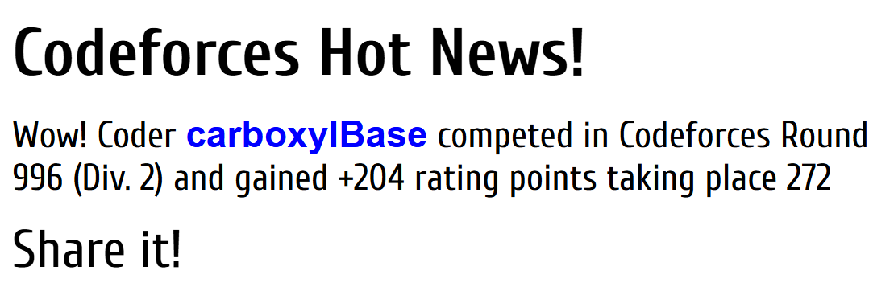

# CF996-Div2

大胜利,Rank391.AC(4/6)

从未达到如此之境界,只感觉做题水到渠成.但是失误还是有的,C题细节没处理好,D题实现上精度出了小问题,导致两发WA,如果有着100分我就290名了.感觉自己的水平可能已经开始质变了,希望能继续保持吧.

rating加的比预期的少,继续加油,争取寒假期间打上橙名.目前是1670,预计至少两场才能打上紫.

# A
太有实力了Div2,一上来就是奇偶博弈.

# B
线性的递推一遍就可以了,没什么值得说的细节.

# C
注意到在前进的过程中某些行列的全部值就被敲定了,于是可以规定行列的和然后模拟一遍得出整个矩阵.

# D
实际上模拟样例可以发现,我们可以让所有点"按兵不动",等到它的位置再决定具体该走到什么位置,然后更新时间和乌鸦位置就可以了.实现时要注意精度问题,不要出现.0这种东西.说实话我不知道为什么答案一定是整数.

# E
正式参赛的选手就没有AC后面两题的,我直接原地下班了,爽.

